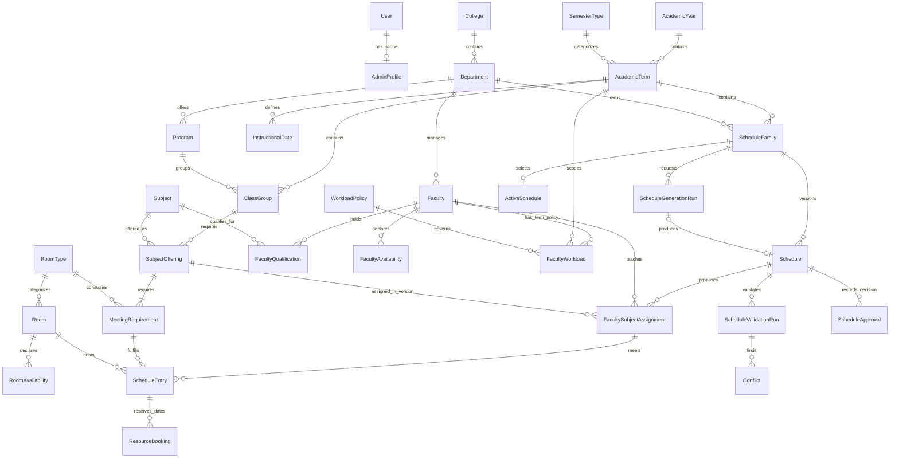
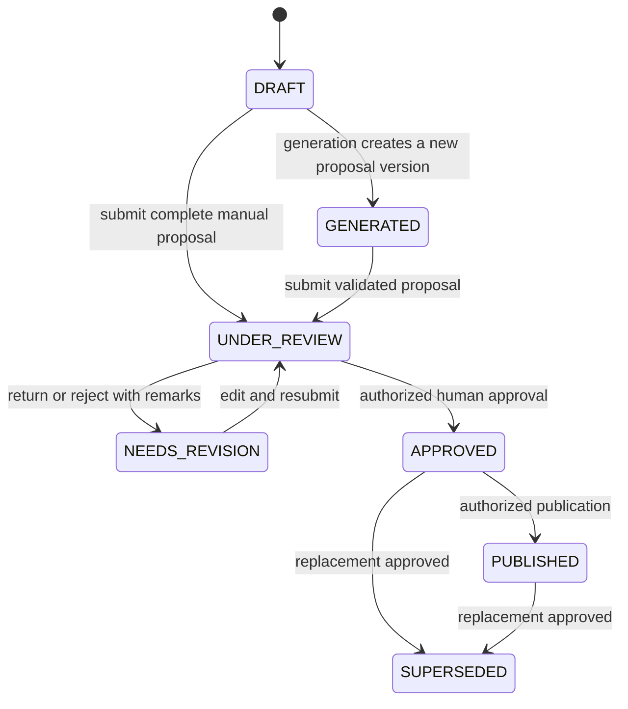

# Development plan and architecture proposal

**Project:** AI-Powered Web-Based Faculty Workload and Academic Scheduling System with Automated Schedule Generation and Conflict Detection
**Institution:** Negros Oriental State University - Bais Campus (NORSU-BSC)
**Repository:** CampusLoad
**Review date:** 2026-09-11
**Status:** Phases 1–4 implemented; Phase 4 verified on 2026-09-15. Stopped before Phase 5. Sections 11–13 are historical implementation records; section 14 records the current state.

Sections 1-10 retain the initial repository review and long-term architecture proposal. They describe the baseline before Phase 1, not the current implementation. Proposed later-phase entities are not implemented merely by appearing here. Section 11 records the authorized Phase 1 changes; the scheduling algorithm remains unchanged.

## 1. Repository baseline and requirements mapping

The repository is an existing Django application, not an empty scaffold. The initial Git working tree was clean. Source, migrations, templates, routes, management commands, and tests were inspected. The private `.env` contents were not read or copied into documentation.

```text
subject_load/
|-- manage.py
|-- requirements.txt
|-- .env.example
|-- README.md
|-- AUDIT.md                     Earlier model audit; partly outdated
|-- config/                      Settings, root URLs, WSGI, ASGI
|-- accounts/                    AdminProfile, scope helper, admin, migrations
|-- core/                        College, Department, Program; seed_demo_data
|-- academics/                   Subject, Curriculum, CurriculumSubject,
|                                Student, IrregularEnrollment
|-- faculty/                     Faculty, Designation, FacultyQualification;
|                                workload services, dashboard, tests
|-- scheduling/                  Room, Term, Block, TimeSlot, Assignment,
|   |                            status log, views, solver, exports, tests
|   |-- templates/scheduling/    Conflict dashboard, suggestions, timetable views
|   `-- migrations/              Includes PostgreSQL triggers/exclusions
`-- venv/                        Local Python environment, not application source
```

| Requirement area | Existing evidence/functionality | Gap and proposed treatment |
| --- | --- | --- |
| Stack | `config/settings.py`, `requirements.txt`: Django, PostgreSQL, decouple, OR-Tools, openpyxl, ReportLab | Retain stack. Django range is `>=5.1,<6.0`; dependency versions are not locked. SQLite unsupported by settings and PostgreSQL-only migration SQL. |
| Authentication | Django auth/session/CSRF middleware, password validators, admin login, `LoginRequiredMixin` | Reuse. Application login/logout URLs/templates are missing; anonymous application requests redirect to unregistered `/accounts/login/`. |
| RBAC | `accounts/models.py`, `accounts/permissions.py`: role plus optional department | Partial: dean and super-admin profiles receive unrestricted querysets. No college scope/configurable staff permissions. Django superuser alone does not satisfy the application's profile requirement. |
| Master data | Hierarchy, faculty, subjects, rooms, terms and blocks registered in admin | Retain IDs/data and useful admin code; add scoped application CRUD, dates, lookup tables, timestamps, validation and retirement. Most ModelAdmin classes have no organizational scoping. |
| Excluded modules | Student, IrregularEnrollment, Curriculum and CurriculumSubject | Scope mismatch. Student counts determine capacity and curriculum placements determine demand. Decouple scheduling; preserve legacy data during migration. No enrollment/curriculum feature expansion. |
| Faculty | Identifier, names, employment type, department, designation release, qualifications, optional User | Add middle name, availability, effective qualifications and configurable employment types. Existing faculty self-service is outside initial target account scope. |
| Workload | `faculty/services.py`: term assignment-unit sums and department aggregation | Useful foundation. Default base load is hard-coded at 24.0. No separate min/target/max; all statuses contribute. Teaching credit on each meeting risks double-counting future multi-meeting offerings. |
| Timetable | Faculty/block grids, model/service validation, PostgreSQL faculty/room/block exclusions | Reuse interval safeguards. Missing offering/meeting requirements, room grid, general manual editor, availability and full term validation. Monday-Saturday is fixed in code. |
| Solver | `scheduling/autoscheduler.py`: real CP-SAT candidate choices, eligibility filters, overlaps and load-deviation objective | Already implemented, not just a plan. At-most-one slot per subject/block permits unfilled demand. One existing assignment marks a subject satisfied. Missing meeting frequency/duration, availability, run/version history, complete status reporting and full independent validation. |
| Generation endpoints | `AutoScheduleSuggestionView`, `CommitAutoScheduleSuggestionsView` | GET runs solver. Blocks are scoped, but faculty/room options are global. POST lacks a specific edit/generation permission and does not replicate input preparation's faculty-department eligibility. Rows commit independently rather than atomically. |
| Conflicts | `validate_assignment` and dashboard capacity/load warnings | Overlap, qualification, room type and department room restrictions exist. Stops at first error; no structured conflict history. Capacity is hard in solver preparation, a dashboard warning, and absent from manual validation. |
| Approval/history | Per-assignment draft -> pending approval -> approved; dean unlock and status log | Human approval exists. No whole-schedule versioning; approval does not rerun full validation. Workflow lacks transaction/locking boundaries. Unlock rewrites approved records; history only covers unlocks. Some endpoints exclude the super-admin role. |
| Reports | Block timetable PDF, department load XLSX | Retain renderer concepts. Missing full report suite, CSV, version selection, consistent context/generated-by metadata and safe formula/markup handling. |
| UI | Five standalone HTML templates, basic CSS/tables | Add shared Bootstrap shell, role navigation, search/filters/pagination, charts, accessible editing, conflict badges and complete workflows incrementally. |
| Audit/security | Password hashing, CSRF, some scope checks, status log | Missing general audit, college isolation, consistent service authorization, restricted admin, login throttling and production settings. Development secret/debug defaults are unsuitable for deployment. |
| Testing | 22 discovered tests in faculty/scheduling; other apps have placeholder tests | Covers load, some permissions, overlaps, workflow and partial commits. Some expectations conflict with requested atomic commits/immutable history and must change with implementation. |

### Verification performed

- Existing virtualenv metadata reports Python 3.14.6. Windows sandbox initially denied its launcher; the approved outside-sandbox system check succeeded.
- `.\venv\Scripts\python.exe manage.py check`: **passed**, no issues. This does not establish database connectivity or scheduling correctness.
- `.\venv\Scripts\python.exe manage.py test --verbosity 1`: **22 tests discovered; database setup failed** because PostgreSQL at `127.0.0.1:5432` refused the connection. No tests completed.
- Database contents/applied migrations, browser workflows and rendered exports remain unverified. No migrations, seeding or application-data writes were performed.

`AUDIT.md` is historical: it proposes overlap constraints that now exist and enrollment work now excluded. Preserve it as history; use this plan for new work.

## 2. Target architecture and module ownership

Use a **modular Django monolith**: one web application and PostgreSQL database, server-rendered templates and domain services. This supports understandable capstone code and transactions spanning scheduling, workload and audit records. A separate SPA or microservices are unnecessary.

Request path: authenticated view -> scoped selector/validated form -> authorized domain service -> ORM/database -> template/export. Views own HTTP concerns; services own mutations, permission checks, validation, transactions and auditing. Selectors centralize authorized reads/aggregates. Do not add a second repository abstraction over the ORM.

| App/module | Ownership and migration approach |
| --- | --- |
| `config` | Settings, URLs and deployment entry points; split dev/test/production settings when justified. |
| `accounts` | Django auth, permission groups, organizational scope and authorization helpers. Evolve AdminProfile; retain existing User to avoid a mid-project auth-table replacement. |
| `core` | College, Department, Program, institution settings, common model helpers and dashboard composition. Retain existing hierarchy ownership. |
| `academics` | Years, terms, instructional calendar, catalog subjects, offerings, class groups and meeting requirements. Gradually take ownership of Term/Block concepts through reviewed migrations. |
| `faculty` | Faculty, configurable employment types, qualifications, availability and external teaching eligibility. Preserve existing faculty IDs. |
| `resources` (new) | Building, RoomType, Room, room access and availability. Move room ownership in stages, not permanent duplicate room tables. |
| `workloads` (new) | Term-effective load policy, overrides/adjustments, version-specific faculty assignments and summaries. Adapt existing aggregation functions. |
| `scheduling` | Schedule versions/entries, validation/conflicts, runs, lifecycle, approvals and resource reservation integrity. |
| `scheduling/engine` (package) | Plain input/output types, CP-SAT adapter, hard/soft constraints and diagnostics; no ORM or request objects in solver logic. |
| `audit` (new) | Append-only important-operation history and scoped readers; service invoked inside mutation transactions. |
| `reporting` (new) | Authorized report selectors, print templates and PDF/XLSX/CSV renderers. No report table needed until persisted jobs are required. |

Proposed eventual structure; create files only as their phases arrive:

```text
subject_load/
|-- config/{settings/,urls.py,asgi.py,wsgi.py}
|-- accounts/{models.py,permissions.py,selectors.py,forms.py,views.py,urls.py,tests/}
|-- core/{models.py,services/,selectors.py,views.py,management/,tests/}
|-- academics/{models.py,forms.py,selectors.py,services/,views.py,urls.py,tests/}
|-- faculty/{models.py,forms.py,selectors.py,services/,views.py,urls.py,tests/}
|-- resources/{models.py,forms.py,selectors.py,services/,views.py,urls.py,tests/}
|-- workloads/{models.py,forms.py,selectors.py,services/,views.py,urls.py,tests/}
|-- scheduling/
|   |-- models.py
|   |-- services/{entries.py,conflicts.py,generation.py,workflow.py,reservations.py}
|   |-- engine/{types.py,cp_sat.py,hard_constraints.py,soft_constraints.py,diagnostics.py}
|   |-- selectors.py, forms.py, views.py, urls.py
|   `-- tests/{test_conflicts.py,test_workflow.py,test_engine.py,test_permissions.py}
|-- audit/{models.py,services.py,selectors.py,admin.py,tests/}
|-- reporting/{selectors.py,views.py,urls.py,renderers/,templates/,tests/}
|-- templates/{base.html,registration/login.html,includes/}
|-- static/{css/,js/,vendor/}
|-- docs/                        Later decisions/operational guides
|-- requirements.txt             Later lock a verified compatible set
|-- .env.example
|-- DEVELOPMENT_PLAN.md
`-- README.md
```

Database apps also include standard apps, migration and admin modules. Keep small models in `models.py`. Model app-label moves must reconcile table names, migration state, content types, permissions and foreign keys; avoid cosmetic moves with no functional benefit.

Use Bootstrap 5, vanilla JavaScript, optional HTMX, and Chart.js for scoped aggregates. Provide a shared sidebar/topbar, explicit current-term selection, status/conflict indicators, search/filter/pagination, labeled forms, keyboard access and responsive tables. Hide unfinished navigation. Vendor frontend assets or use controlled dependencies; no paid cloud AI API is needed.

## 3. Normalized domain model

### Conventions and validation

- Use surrogate primary keys, foreign keys and scoped unique natural identifiers. Derive College from Department instead of duplicating it on every record.
- Mutable master/configuration records have `created_at`, `updated_at`, relevant `created_by` and active/retired state. Transactional records have lifecycle states. Store timestamps in UTC; interpret class times in configured institution timezone.
- Retire referenced master data; use `PROTECT` for historical relations. Inactive faculty/rooms remain in history but cannot enter new proposals. Cascade only truly dependent draft data under controlled deletion.
- Audit/approval events are append-only with actor/time/reason. Disable users rather than erase authorship; protect history actors. Exclude secrets from audit payloads.
- Database checks enforce positive durations/counts, nonnegative numeric values, ordered dates/times, recognized statuses and valid nullable scope combinations. Add unique identifiers and single-active-selection constraints.
- Forms/services enforce related-record hierarchy. A plain CHECK cannot validate arbitrary joins; use reviewed PostgreSQL triggers/composite foreign keys for critical cross-term/version consistency and test direct database bypasses. Do not assume every model's `save()` invokes `full_clean()`.
- Approved history stores immutable source/policy/calendar/label snapshots while retaining foreign keys. Snapshots are archival evidence, not competing editable master data.

### Proposed entities and keys

| Owner | Entity | Attributes, relationships and key rules |
| --- | --- | --- |
| Django auth | `User`, `Group`, `Permission` | Retain User; permission groups define initial role bundles. New user FKs use `settings.AUTH_USER_MODEL`. |
| accounts | `AdminProfile` (evolved) | One-to-one User; INSTITUTION/COLLEGE/DEPARTMENT scope, nullable College/Department. Check required/exclusive scope fields. Permissions authorize actions; role label is descriptive. |
| core | `InstitutionSettings` | Singleton institution identity, timezone, optional default term; no invented policy values. |
| core | `College`, `Department`, `Program` | Unique college code; Department -> College unique `(college, code)`; Program -> Department unique `(department, code)`. |
| academics | `AcademicYear` | Unique label, start/end dates, active state. Do not infer dates by parsing label. |
| academics | `SemesterType` | Configurable unique code/name/order; no fixed semester list. |
| academics | `AcademicTerm` | Year + SemesterType + period code, dates and planning/closed state; unique `(academic_year, period_code)`; dates within year. |
| academics | `InstructionalDate` | Term + date, unique pair; records actual teaching dates/closures for recurrence expansion. |
| academics | `Subject` | Catalog code/title, owning Department, credit units, default lecture/lab minutes; nonnegative values. Retain global unique code until institutional code scope is confirmed. |
| academics | `ClassGroup` | Term + Program + optional year level + section code + nullable expected size. Unique term/program/section/year, with explicit uniqueness handling for null year levels. Replaces mandatory Curriculum on Block. |
| academics | `SubjectOffering` | Subject + ClassGroup + offering code, term-specific credit/contact values; term/program derive from group. Unique `(class_group, offering_code)`; repeated subjects require explicit validation. |
| academics | `MeetingRequirement` | Offering + component code, weekly meeting count, duration minutes, optional required RoomType/mandatory flag. Unique offering/component; weekly minutes = count x duration. Unequal durations use separate requirements. |
| faculty | `EmploymentType` | Configurable unique code/name, active state; classification does not automatically imply load limits. |
| faculty | `Faculty` | Employee ID, first/middle/last names, home Department, EmploymentType, active state. Existing optional User link only for compatibility; accounts not required. |
| faculty | `FacultyQualification` | Faculty + Subject, evidence/remarks and effective dates; prevent duplicate equivalent validity records. Do not infer eligibility from free-text specialization. |
| faculty | `FacultyTeachingAuthorization` | Faculty + receiving Department + Term, grant actor/status. Unique active faculty/department/term; scheduling eligibility does not grant access to private faculty records. |
| faculty | `FacultyAvailability` | Faculty + Term + weekday/start/end, AVAILABLE/UNAVAILABLE/PREFERRED, optional effective dates. Hard unavailable overrides preference. |
| resources | `Building`, `RoomType` | Configurable codes/names; Building optional on Room. RoomType shared with requirements. |
| resources | `Room` | Unique code/name, optional Building, RoomType, nullable known capacity, active state, shared/restricted access mode. Unknown capacity differs from zero. |
| resources | `RoomDepartmentAccess` | Room + Department unique pair. Restricted room with no grants denies all; shared mode follows institution policy. |
| resources | `RoomAvailability` | Room + Term + weekday/start/end, AVAILABLE/UNAVAILABLE, optional effective dates. |
| workloads | `WorkloadPolicy` | Versioned code, effective term/date range, scope, metric (units/contact hours), nullable min/target/max, limit severity and release method. Validate known min <= target <= max and unambiguous policy precedence. |
| workloads | `FacultyWorkload` | Unique Faculty + Term; policy reference and explicit overrides/reasons. Stores configuration, not separately editable assigned-load totals. |
| workloads | `WorkloadAdjustment` | FacultyWorkload + configured adjustment type + amount/reason/author. Replaces timeless designation release; Designation may remain a lookup. |
| workloads | `FacultySubjectAssignment` | Schedule version + Offering + Faculty + credited load + manual/fixed/recommended source. Unique schedule/offering in V1; teaching credit counted once, not per meeting. |
| scheduling | `ScheduleFamily` | Term + owning Department, unique pair. Stable version owner/lock target; college/campus views compose department families. |
| scheduling | `Schedule` | Family + version, parent Schedule, status, edit revision, source/config snapshots and hashes, author. Unique family/version; parent belongs to same family. |
| scheduling | `ScheduleEntry` | FacultySubjectAssignment + MeetingRequirement + sequence + Room + weekday/start/end. Unique assignment/requirement/sequence; requirement belongs to assignment offering. Schedule/faculty derive from assignment; only add validated indexed copies needed for exclusions. |
| scheduling | `ScheduleTimeBlock` | Term/policy scope, allowed weekday/window and scheduling increment. Window length does not determine subject duration. |
| scheduling | `SchedulingConstraint` | Versioned typed rule key, scope/term, validated parameters, permitted hard/soft behavior, nonnegative soft weight, enabled state. Registered rule handlers only; never user-supplied executable code. |
| scheduling | `ScheduleGenerationRun` | Requester/family/source revision, input/config snapshots/hashes, solver version/seed/limits, run state, raw solver status, score/bound/statistics/diagnostics, optional resulting Schedule. Idempotency key prevents duplicate requests. |
| scheduling | `ScheduleValidationRun` | Schedule + edit revision + input/policy hash, validator version, time/outcome. Conflicts refer to a specific validation revision. |
| scheduling | `Conflict`, `ConflictAffectedRecord` | ValidationRun + code/severity/message/action. Affected-record rows have typed entry/assignment/faculty/room/group FKs, exactly one target each; supports multiple implicated records. |
| scheduling | `ConflictAcknowledgment` | Conflict + authorized actor/reason/time; warning-only and valid only for that revision. Hard errors cannot be dismissed. |
| scheduling | `Recommendation` | Run or Schedule, optional Offering/Faculty/Entry, score components/evidence, accepted/declined decision and actor. No invented explanations. |
| scheduling | `ScheduleApproval` | Schedule/revision/hash, action, old/new state, actor, remarks and time; append-only submission/return/approval/publication/replacement history. |
| scheduling | `ActiveSchedule` | One-to-one Family + selected approved/published Schedule. Enforce same family/status; at most one selected version. |
| scheduling | `ResourceBooking` | Selected entry + actual instructional date/start/end + validated faculty/room/group keys. Unique entry/date; PostgreSQL exclusions across active departments and overlapping terms. Derived active reservation index; historical entries/events survive replacement. |
| core | `SystemSetting` | Registered non-policy key, typed value/revision/author. Branding/report defaults here; load/scheduling policy in typed models. No secrets. |
| audit | `AuditLog` | Actor/action/object reference, organizational scope, timestamp/request ID, sanitized before/after values/reason. Append-only; snapshots may preserve historic labels. |

V1 assumes one program/class group and one assigned instructor per offering, with weekly recurrence on instructional dates. This is a proposed product boundary, not NORSU policy. Team teaching, merged sections and alternating-week teaching require additional relationship/occurrence design; reject unsupported input explicitly.

### ERD overview

Configuration/audit detail is specified in the table; this diagram shows principal relationships.



### Essential relationship rules

1. Schedule family term = offering group term; group program belongs to schedule owner department. External faculty require explicit teaching authorization. Ownership and eligibility are separate.
2. Requirement belongs to assignment offering; entry duration/sequence satisfies requirement. Every mandatory meeting must exist before submission or approval.
3. Check availability on applicable instructional dates. Use half-open `[start, end)` intervals consistently; adjacent classes do not overlap.
4. Alternative proposals may overlap each other; entries within one version may not. Existing global-per-term Assignment exclusions require a deliberate replacement during version migration.
5. Trusted validation considers authoritative external faculty/room bookings institution-wide. Return scope-safe messages such as “room occupied” without exposing other colleges' private records.
6. Approval reserves actual dates, including across overlapping academic terms. A term-only weekly exclusion cannot protect that case.
7. Workload preview sums the selected version plus authoritative external assignments, excluding the selected family's old version during replacement. Never sum all alternatives or credit units once per meeting. Label proposed versus official totals.
8. Changed requirements/policies invalidate dependent drafts or create new source revisions. Approved reports use frozen values and historical ownership; later department transfers do not rewrite history.

## 4. RBAC permission matrix

Authorization requires an active authenticated user, explicit action permission, valid organizational scope, and legal workflow state. Groups provide permission bundles, not row isolation; implement scoped selectors and mutation guards ([Django permissions](https://docs.djangoproject.com/en/5.2/topics/auth/default/), [object permissions](https://docs.djangoproject.com/en/5.2/topics/auth/customizing/#handling-object-permissions)).

Legend: **I** institution; **C** own college; **D** own department; **G** only explicitly granted actions within assigned scope; **-** denied by default. Reading does not imply export/edit authority.

| Capability | System admin | College dean | Department chair | Authorized staff |
| --- | --- | --- | --- | --- |
| Users, roles and grants | Manage I | - | - | - |
| Colleges/departments/programs | Manage I | Read C | Read D | G read |
| Academic years/terms/calendar/global settings | Manage I | Read applicable | Read applicable | G read |
| Faculty/qualification records | Manage I | Read C | Manage D | G |
| Faculty availability/workload within permitted policy | Manage I | Read C | Manage D | G |
| Subject catalog/offerings/groups | Manage I | Read C | Manage D, respecting catalog ownership | G |
| Rooms/types/access policy | Manage I | Read eligible | Read eligible | G; central edit only if granted |
| Global scheduling/workload policy | Manage I | Read applicable | Read applicable | G read |
| Delegated scoped policy overrides | Manage I | G within C | G within D | - |
| Faculty assignment/proposal editing/generation | Manage I | Read C by default | Manage D | G |
| Submit for review | I permission | - by default | D | G |
| Review/request revision | I permission | C | D internal review | G internal review |
| Approve/reject submission | I permission | C when designated approver | - | - |
| Publish approved schedule | I permission | C when publication granted | - | - |
| Dashboards/schedules/conflicts/recommendations | I | C | D | G |
| Export reports | I | C | D | G export |
| Read audit logs | I | G scoped C | G scoped D | - |
| Retire master records | I | - | G owned D | G permitted types |

- Keep Django User and initial role groups: System Admin, College Dean, Department Chair, Authorized Staff. Custom permissions include `generate_schedule`, `submit_schedule`, `review_schedule`, `approve_schedule`, `publish_schedule`, `export_report`, `manage_policy`, `view_auditlog`.
- One organizational scope per account in V1. Department scope stores Department only; College is derived. College scope stores College only; institution scope stores neither. Multiple independent scopes need a future membership design.
- Staff default to no permissions and receive selected model/custom capabilities. Role grants and approval are not staff defaults; approval remains a guarded designated-approver capability.
- Restrict Django admin to system administrators initially. Django `is_staff` means admin-site access; do not equate it with the business Authorized Staff role. Unscoped ModelAdmin classes cannot serve dean/chair workflows.
- Superuser emergency access is explicit/audited but cannot bypass schedule integrity or lifecycle. Default reviewer differs from submitter; a documented configurable self-approval policy can change this only through authorized institutional configuration.
- Scope lists, details, form choices, POST foreign keys, counts, charts, exports, autocomplete and background jobs. Hidden buttons are not security. Normally return 404 for out-of-scope objects, 403 for denied actions.
- Expose only authorized eligibility and shared-room busy/free information. Do not widen profile access just because a faculty member can teach externally.
- Application login, POST logout, CSRF, password/session protection and login throttling belong in the foundation/deployment work. Test revoked/deactivated accounts, unsafe `next` redirects and direct URL/POST manipulation.

## 5. Schedule lifecycle and historical integrity

Status belongs to a whole Schedule version. Failed solving is a GenerationRun outcome, not a schedule lifecycle state.



The generation arrow represents lineage: generation always creates a **new version**, including when starting from an approved version. It never overwrites its source. Failure/incomplete output produces no reviewable GENERATED schedule; diagnostic partial output may stay on the run, visibly marked incomplete.

| Action | Guard and effect |
| --- | --- |
| Edit | Only DRAFT/GENERATED/NEEDS_REVISION, correct scope/permission. Increment revision; invalidate validation and warning acknowledgments. GENERATED denotes origin, not guaranteed validity after edits. |
| Generate | Generation permission, ready inputs, new run/version; no automatic approval. |
| Submit | Complete faculty assignments/meeting coverage, current validation, zero hard conflicts, required warning acknowledgments. Freeze UNDER_REVIEW revision; append history. |
| Return/reject | Authorized reviewer, mandatory remarks; NEEDS_REVISION and decision history. Preserve rejected proposal. |
| Approve | Designated scoped human approver, reviewer-separation rule, revalidated current inputs/workload/all active occupancy. Atomically select version and reserve resources. |
| Publish/finalize | Publication permission and APPROVED state; verify selected version/readiness; append publication event. |
| Revise approved/published | Clone new DRAFT with parent; retain previous active selection/bookings until replacement is approved. Never unlock approved records in place. |
| Replace | Lock family/reservations; exclude only explicitly replaced version during comparison; validate and atomically swap selection/bookings. Old version becomes SUPERSEDED; retain entries/snapshots/history. |

Use short transactions: snapshot consistent inputs, solve outside locks, then lock/recheck source revision, policies, permissions and resource state before saving complete proposal/assignments/entries/validation/audit. Stale inputs yield STALE_INPUT. After rollback, persist run failure separately so a failed commit remains diagnosable.

Submission, approval, publication, replacement and multi-row edits use `transaction.atomic()` plus row locking and revision tokens. Recheck authorization/state after locks; idempotency keys protect retries. A batch failure rolls back every row rather than retaining an accidental partial schedule. See [Django transactions](https://docs.djangoproject.com/en/5.2/topics/db/transactions/).

## 6. Scheduling and conflict engine

### Pipeline and service boundaries

1. **Request:** POST, generation permission, selected family/term/source revision; persist run and limits. GET only reads run state/results.
2. **Prepare:** Demand, eligible resources, availability/calendar, meeting requirements, fixed decisions, workload policy and authoritative external occupancy. Trusted reads never widen user-visible scope.
3. **Preflight:** Validate hierarchy/dates/units/readiness; report absent policies, evidence/windows and zero-candidate meetings. Invalid data differs from proven infeasibility.
4. **Snapshot:** Immutable plain input types plus hashes/provenance, including occupancy/policy revisions. Solver receives no ORM/request objects.
5. **Solve:** Integer-minute placements with exactly one legal placement per mandatory meeting. Phase 5 keeps faculty assigned in advance; Phase 6 adds faculty-choice variables shared across an offering's meetings.
6. **Evaluate:** Extract complete result; independently validate overlap/coverage/eligibility and recompute objective components. Invalid solver output is an error, never an approvable proposal.
7. **Persist:** Recheck/lock source/resources, then atomically save a new proposal and findings. Stale inputs require regeneration/revalidation.
8. **Review:** Show raw solver status, completeness, runtime, score/bound where defined, unsatisfied soft rules and evidence-backed recommendations; allow valid manual adjustment.

Interfaces: `prepare_inputs(actor, family, revision) -> SchedulingInput`; `solve(input, config) -> SolverResult`; `validate_schedule(snapshot, occupancy) -> ValidationResult`; `commit_proposal(actor, run, result)`; `transition_schedule(actor, schedule, action, expected_revision, remarks)`.

Run state QUEUED/RUNNING/SUCCEEDED/FAILED/CANCELLED/STALE_INPUT is separate from CP-SAT status. Start with a management-command worker processing persisted runs, keeping long computation out of HTTP requests. Add a queue platform only when necessary; dispatch downstream jobs after transaction commit.

### Hard constraints

| Required feasibility rule | Enforcement |
| --- | --- |
| Faculty overlap | No overlapping occurrences for one faculty within proposal or authoritative external bookings. |
| Room overlap | Same for rooms across departments/shared use. |
| Section overlap | Same for the class group. |
| Faculty hard unavailability | Honor unavailable periods and positive available windows in the selected availability mode. |
| Room availability | Honor open windows, closures and unavailable periods on actual dates. |
| Duration/coverage | Every mandatory meeting exactly once at full duration; lecture/lab minutes satisfied separately. |
| Mandatory room type | Enforce component's required type; no silent lecture-room fallback for laboratory demand. |
| Active/eligible resources | No inactive faculty/room; honor room-access and external teaching grants. |
| Term/hierarchy | All offerings/groups/requirements/assignments/entries share chosen term/version/ownership chain. |
| Valid time | End after start, allowed increment/window, valid instructional dates; reject unsupported overnight intervals. |
| Fixed decisions | Preserve fixed faculty/placements and authoritative external reservations. |

These core feasibility rules cannot be weakened to preferences. Qualification requirements, numerical load ceilings, capacity and daily limits have configurable enforcement where policy permits. Once mandatory, they apply equally in solver and manual validation. Missing mandatory size/capacity is a readiness error; missing workload policy never becomes an invented limit.

### Soft constraints and workload optimization

| Objective | Measurement |
| --- | --- |
| Faculty balance | Absolute deviation from configured target in selected metric; optional capacity-normalized comparison for unequal appointments. |
| Preferred times | Count/minutes outside preferred windows; unavailable remains hard. |
| Idle gaps | Minutes between same-day meetings, with configured break exclusions. |
| Consecutive teaching | Minutes beyond preferred consecutive-class threshold. |
| Weekly distribution | Penalties for concentrations/repeated same-day meetings relative to configured targets. |
| Room utilization | Unused known seats or allowed room-preference penalties; unknown capacity is not scored as zero. |
| Compactness/undesirable periods | Configured occupied-span/days-on-campus and time-period penalties. |

Use nonnegative integer weights and documented Decimal-unit/contact-minute scaling. Report raw components as well as weighted score. Never trade missing mandatory meetings for a better objective. Resolve competing preferences through configurable weights/priorities.

Phase 6 optimizes eligible instructor choices, counts credit once per offering, includes authoritative external loads, respects fixed manual decisions and configured hard maxima. Explain recommendations using actual qualification, feasible availability and remaining capacity. Administrators may decline and choose another valid assignment; no random “AI” score or fabricated evidence.

### Statuses, repeatability and diagnostics

Preserve OPTIMAL, FEASIBLE, INFEASIBLE, UNKNOWN and MODEL_INVALID. Time-limited search with no solution is UNKNOWN, not proof of INFEASIBLE. FEASIBLE satisfies hard constraints without proving optimality ([official CP-SAT statuses](https://developers.google.com/optimization/cp/cp_solver)).

- **INFEASIBLE:** no complete proposal. Show candidate shortages/resource bottlenecks and assumption-based unsatisfiable subsets where supported. Label likely blockers accurately; do not claim minimal explanations unless computed.
- **UNKNOWN:** no feasible result established before limits; show configurable runtime/search suggestions without automatically relaxing rules.
- **MODEL_INVALID/ERROR:** retain source draft, record sanitized diagnostics and display failure.
- Record input/config hashes, solver version/seed/workers/limits, runtime, variable/constraint counts, objective/bound and completeness. Deterministic validator required; reproducible tests use stable input order, fixed seed, pinned versions and one worker. Multiworker/time-limited search may return different valid solutions.
- Avoid campus-scale Cartesian candidate enumeration with all-pairs overlaps. Benchmark pruning and interval/no-overlap or indexed-occupancy representations on representative data before final implementation. No algorithm change is part of this review.

### Reusable conflict service

Return all findings with stable type/severity, typed affected records, human explanation and corrective action. Required codes: FACULTY_OVERLAP, ROOM_OVERLAP, SECTION_OVERLAP, FACULTY_UNAVAILABLE, ROOM_UNAVAILABLE, ROOM_TYPE_MISMATCH, ROOM_CAPACITY_WARNING, WORKLOAD_LIMIT_WARNING and INVALID_TIME_ASSIGNMENT. Add MISSING_REQUIRED_MEETING, TERM_MISMATCH, INACTIVE_RESOURCE and QUALIFICATION_MISMATCH.

Share rule predicates/interval conventions while independently checking extracted solver coverage/overlaps. Manual attempted errors roll back and display findings; accepted draft warnings persist with validation revision. Revalidate after every entry change, submission and approval. Stale findings cannot authorize approval; hard errors cannot be acknowledged away. Never silently displace another schedule.

## 7. Ambiguities and configurable assumptions

These are proposed fallback behaviors, not invented institutional policies.

| Unclear requirement | Proposed handling |
| --- | --- |
| Colleges/departments/programs | Administrator-managed; legacy fixtures are not institutional truth. |
| Workload metric, lecture/lab weighting | Explicit typed policy; display credit units and contact hours separately; no assumed equivalence. |
| Min/target/max and designation releases | Term-effective configuration; null means unconfigured. Require policy before balancing/claiming compliance. Reject unexplained negative targets. |
| Multiple active terms | Allow multiple planning terms; require explicit selection; default term is only UI convenience. |
| Labels/dates/teaching days | Configurable calendar and all seven weekday identifiers with permitted windows; no assumed six-day week. |
| Missing availability | Require explicit mode: declared available windows or institution windows minus unavailability. Until configured, flag readiness rather than assume 24/7. |
| Capacity/class size | Nullable expected size independent of enrollment. Unknown values produce visible warning or block when policy mandatory. |
| Qualifications/external teaching | Explicit evidence/eligibility; no guessing from names or department. |
| Approval/delegation/self-approval | Scoped designated grant; default reviewer differs from submitter; policy changes audited. |
| Shared rooms | Explicit access grants plus institution-wide active occupancy checks; scope-safe messages. |
| Warning acknowledgments/soft weights | Typed configuration; hard feasibility rules cannot be disabled. |
| Team teaching/merged sections/alternating weeks | Outside proposed initial data shape; reject unsupported input and extend deliberately if required. |
| Retention/transfers | Preserve immutable history and prior ownership; no automatic approved-history deletion initially. Retention duration remains configurable. |
| Timezone | Explicit institution setting; propose Asia/Manila for confirmation. Current app is UTC; do not inherit developer computer timezone. |
| SQLite | Defer; supporting it needs vendor-aware migrations and documented replacement/loss of PostgreSQL guarantees. |
| Scale/time limits | Obtain dataset counts and target hardware; configure time/workers and benchmark before performance promises. |

## 8. Incremental roadmap

Every phase must remain runnable, explain touched modules/database impact before coding, preserve prior working behavior during transition and include meaningful validation. Security and tests start in Phase 1, not Phase 10.

| Phase | Modules and deliverable | Database impact | Acceptance gate |
| --- | --- | --- | --- |
| 0: This review | Plan, README, comparison/ERD/RBAC/lifecycle/engine design | None | Distinguish actual/proposed behavior; stop for architecture approval. |
| 1: Foundation/auth/RBAC | `accounts` scope/permissions/forms/views/URLs/tests, `config`, base/login templates, role bootstrap, existing endpoint/admin guards; minimal audit | Scope validation and group/custom permission mapping; explicit legacy role mapping, no guessed dean college; audit records for important account/grant changes | PostgreSQL baseline established; login/POST logout and scoped landing page work; cross-college dean access denied; staff limited; missing/inactive scope denied; superuser bootstrap works. |
| 2: Master data | `core`, `academics`, `faculty`, new `resources`; CRUD/search/filter/pagination | Configurable years/terms/calendar/types, dates/status/timestamps, groups/offerings/requirements; staged Term/Block/Room mapping | Valid hierarchy, protected history, fresh/upgrade migrations; scheduling no longer requires enrollment/curriculum CRUD. |
| 3: Availability/assignments/workload | Faculty/resource availability, `workloads`, policy forms/summaries | Policies/overrides/adjustments/availability/teaching grants and FacultySubjectAssignment; introduce minimal ScheduleFamily/Schedule now for alternative isolation | Availability boundary tests; missing policy visible; units counted once; separate min/target/max; external loads included without counting alternatives. |
| 4: Manual timetable/conflicts | Scheduling entry/conflict/reservation services, forms and faculty/room/group grids | Versioned entries, validation/conflict/acknowledgment records, term/version consistency, per-version exclusions; prepare booking schema | Atomic editing; visible/rejected hard conflicts; adjacency legal; database bypass rejection; out-of-scope POST denied; coverage readiness checked. |
| 5: CP-SAT generation | Engine package, generation orchestration/worker/status UI/tests | Run snapshots/provenance and fresh proposal per successful generation | Complete coverage or explicit infeasible/unknown/invalid-data result; independent validation; no auto-approval; stale inputs/retries/failure preserve source. |
| 6: Balancing/recommendations | Workload objectives/eligibility, soft handlers and recommendation UI | Versioned weights and recommendation evidence/decisions | Compare measured load deviation to baseline; preserve hard maxima/fixed decisions; factual explanations and validated overrides. |
| 7: Review/approval/versioning | Workflow/reservation services, history UI/concurrency tests | Approval events, active selection, dated official bookings/replacement history | Scoped human approval; revision/warning checks; concurrent shared-resource claims cannot both commit; immutable historical snapshots; atomic transitions/audit. |
| 8: Dashboard/monitoring | Scoped selectors, shared UI/term selector, Chart.js | Read indexes only when query measurements justify | Correct scoped faculty/load/room/proposal/approval/conflict counts, known utilization denominators, empty states, keyboard/responsive checks. |
| 9: Reports/exports | `reporting`, print templates, PDF/XLSX/CSV, export audit | No stored-report table required initially | Individual/department/college loads; faculty/room/group/master timetables; conflict/utilization/approval history; required context/author/date/version; escaping/scope and visual export checks. |
| 10: Release readiness | Cross-module security/performance/tests, deployment config, dependency lock, operational/thesis docs | Reviewed indexes, migration/restore rehearsals, retention configuration | PostgreSQL and concurrency suite passes; representative performance data; secure sessions/HTTPS/static/worker setup; backup/restore verified; limitations documented. |

Version foundations arrive in Phases 3/4 because postponing isolation until after the solver would require a risky rewrite. Phase 7 completes approval and active schedule selection.

### Preservation and migration sequence

1. Restore local PostgreSQL connectivity, inspect applied migrations and run existing tests. Do not reset/delete databases to obtain a baseline; back up before migration.
2. Add structures/mapping fields first. Preserve IDs and explicit legacy-to-new maps. App-label changes must reconcile database tables, migration state, content types and permission codes.
3. Map existing department admins to limited staff; require explicit college assignment for deans, denying incomplete scopes. Never infer a dean college from missing data.
4. Map years/terms/groups from legacy values. Labels do not prove dates; flag unknown dates, durations/frequency/size/policy for review.
5. Import offerings from existing demand only as one-time migration inputs. Student counts may seed expected size with provenance and administrator review; no continuing enrollment dependency.
6. Convert Assignment rows into versioned faculty assignments and meetings with reconciliation. Repeated subject/block rows may be meetings or duplicates; do not blindly sum credits. Produce exception reports for unknown semantics.
7. Preserve legacy approved rows/metadata as immutable legacy history until verified. Mixed entry statuses cannot automatically become one APPROVED schedule; never fabricate missing approval events.
8. Replace old global Assignment exclusions with per-version entries plus active dated bookings at controlled write cutover. Old/new writers must not independently maintain competing occupancy stores.
9. Switch read/write paths, retire excluded feature routes/admin exposure and keep legacy data. Destructive table removal is a separately reviewed migration after retention is resolved. Never rewrite applied migrations to erase history.

### Verification and capstone evaluation

- **Authorization:** two colleges/multiple departments, all roles/limited grants; lists/details/counts/exports/form choices/POST foreign keys/jobs/admin exposure, revocation and inactive accounts.
- **Models/migrations:** direct database bypasses, cross-term/hierarchy errors, protected deletion, fresh/upgraded PostgreSQL. Verify existing trigger-populated Assignment fields interact correctly with `full_clean()` when baseline tests become runnable.
- **Conflicts:** adjacency and partial overlaps, date/weekday distinctions, availability closures, inactive resources, wrong room type, unknown/exceeded capacity, missing/extra/wrong-duration meetings, overlapping terms and shared resources.
- **Solver:** known feasible/infeasible fixtures, no-candidate cases, fixed assignments, multi-meeting demand, availability, timeout distinction, independent validation and objective recomputation; stable single-worker benchmarks.
- **Transactions:** PostgreSQL TransactionTestCase/concurrent sessions for competing edits/approvals/bookings; injected mid-batch failure proves rollback; stale inputs and idempotent retries.
- **Workflow:** illegal transitions, reviewer separation, remarks/acknowledgments, current revision and immutable replacement history.
- **Reports/UI:** authorized context, safe filenames and CSV/XLSX formula-like text, escaped PDF markup, institution/college/department/year/term/date/author metadata, proposal watermark/version, pagination/print rendering and accessibility.
- **Evaluation:** zero hard conflicts and full coverage for accepted proposals; runtime, feasibility/timeout rate, workload deviation and preference satisfaction versus documented baseline. Solver use alone does not prove institutional benefit.

## 9. Principal risks

| Risk | Mitigation |
| --- | --- |
| Existing dean scope/global options expose wider data | Phase 1 protects current endpoints/admin as well as new pages. |
| Tests have no running database baseline | Establish PostgreSQL connectivity before implementation; system check is not a test pass. |
| Tests encode incompatible partial commits/unlock behavior | Replace those expectations deliberately alongside relevant atomic/versioned features; retain useful coverage. |
| Institutional policy/data unavailable | Readiness checks/null semantics; no invented load or duration defaults. |
| Alternatives overlap or double-count workloads | Versioned entries/assignments and one selected active family version, introduced before solver. |
| Concurrent departments claim shared resources | Trusted cross-scope validation and atomic PostgreSQL dated booking exclusions. Scalar-plus-range exclusion support is described in [btree_gist documentation](https://www.postgresql.org/docs/current/btree-gist.html). |
| Legacy enrollment/curriculum coupling | Migrate with provenance and exceptions; retire interfaces before destructive removal. |
| Master/policy edits rewrite history | Effective versions and immutable snapshots/approval events. |
| CP-SAT scale/search variation | Domain pruning/benchmarks, limits/provenance, deterministic validation/test mode. |
| Admin bypasses workflow | Restrict admin; make approved/history data read-only; enforce essential DB invariants. |
| Deployment uses development settings | Dependency lock, environment/HTTPS/cookie/static/worker checks, least-privilege DB and backup/restore rehearsal. |

## 10. Original recommended implementation step (completed in Phase 1)

After architecture approval, start **Phase 1: establish the PostgreSQL test baseline and implement application authentication plus scoped RBAC**. First slice: login/POST logout, validated college/department/institution scope, role permission bootstrap, guarded existing views/admin and dean/staff isolation tests. Add only scope/audit migrations needed for that slice.

Leave the existing scheduling algorithm unchanged until the approved roadmap reaches generation work. Later phases require the owner's next instruction.

## 11. Phase 1 implementation record

**Completed:** 2026-09-11. The owner explicitly authorized Phase 1, including organizational/calendar models, settings, auditing, authentication, RBAC, dashboard layout, migrations, seed data and tests. No Phase 2 faculty/subject/room management or scheduling feature was implemented.

### Implemented modules and database changes

- `config/settings.py`: environment-driven PostgreSQL configuration, explicit secret, safe production defaults, host/CSRF origins, configurable institution/timezone, session security and static assets. `config/test_settings.py` isolates fast test hashing from real application settings.
- Existing Django User retained because applied model relationships already reference it; a replacement user table offered no Phase 1 benefit. `accounts/backends.py` adds role capabilities to Django model/group/user permissions. AdminProfile scope remains independently required.
- `accounts`: System Admin, College Dean, Department Chair and Authorized Staff; validated college/department scope, disabled-profile handling, application login and POST logout. Staff start with dashboard access only; administrators grant additional model permissions individually or through groups.
- College/Department tables retained with active status, authorship/timestamps and protected hierarchy. Scoped read-only lists/details/search/pagination demonstrate row isolation; only system administrators edit foundation data through Django admin.
- `academics`: AcademicYear, configurable Semester and AcademicTerm, dates, unique identifiers and protected references. PostgreSQL triggers enforce term/year date containment even when ORM validation is bypassed. These new models do not reinterpret legacy scheduling.Term data automatically.
- `core.SystemSetting`: registered institution-name/support-email settings, validation and admin. Scheduling/workload policies are not introduced here.
- New `audit` app: append-only AuditLog, transactional admin create/update/delete events, authentication events and seed events. PostgreSQL triggers reject audit updates/deletes; secrets are not stored in login-failure records. This is an audit foundation, not a claim that arbitrary shell/ORM writes are audited automatically.
- `templates` and `static`: shared locally vendored Bootstrap 5.3.8 layout, responsive sidebar, permission-aware navigation/counts, scope/account labels, login, calendar, read-only organizational pages and friendly access errors.
- Custom admin site admits only active system administrators with Django `is_staff`; Django superusers have explicit institution-wide access without needing a profile. Legacy faculty, scheduling, program/curriculum/student models remain in migration history but are not exposed in Phase 1 admin/routes.
- `bootstrap_roles` creates default permission bundles without replacing existing grants. `seed_foundation` creates fictional organizational/calendar examples only; optional accounts use generated passwords in a Git-ignored file. Repeated seeding preserves existing passwords and edited records.

Additive migrations: `core/0002`, `academics/0004-0005`, `accounts/0003`, `audit/0001-0002`. All previous migrations are preserved. Existing department-admin profiles map to staff; legacy deans are disabled until a system administrator assigns their college. Invalid legacy scopes are disabled rather than granted institution-wide access.

### Development database and verification

The configured PostgreSQL service was unavailable. An isolated PostgreSQL 17.6 development instance was prepared at `127.0.0.1:55432`, database `campusload_phase1`, using the Zonky Windows binary package from Maven Central (checksum verified). It listens only on loopback and uses generated SCRAM credentials. `.local/` holds binaries, cluster, logs and credentials; none are tracked. The original `.env` was backed up to `.local/original.env` before pointing development settings to this database. The helper is for local development, not production provisioning.

- `manage.py migrate --noinput`: all migrations applied successfully, including PostgreSQL triggers and exclusion constraints.
- `manage.py seed_foundation --create-users`: completed; four role accounts and fictional foundation data created, no faculty or assignments seeded into the application database.
- `manage.py test --settings=config.test_settings --noinput`: **52 tests passed** (30 new foundation/auth/RBAC/migration tests plus 22 retained legacy tests).
- `manage.py makemigrations --check --dry-run`: no changes detected.
- Django system check passed; Git whitespace check passed.
- Browser verification: real dean sign-in, scoped dashboard, desktop layout, 390px mobile layout and mobile sidebar opening/closing. Bootstrap assets are local; no CDN runtime dependency.

Legacy tests use `config.legacy_test_urls` only within explicit test overrides so their service behavior remains covered while production URLs stay unmounted. Fixtures were updated for the new staff role and required dean college. The only legacy view edit replaces the old department-admin role constant with staff; no timetable algorithm or workflow feature was expanded.

### Current permissions and boundaries

| Role | Effective scope | Foundation capabilities |
| --- | --- | --- |
| System Admin / Django superuser | Institution | All foundation data, user/group/profile management and audit inspection; admin-site access also requires `is_staff`. |
| College Dean | Assigned college | Dashboard, own college/departments, shared academic calendar; no Django admin. |
| Department Chair | Assigned department | Dashboard, own department/parent college, shared academic calendar; no Django admin. |
| Authorized Staff | Assigned college OR department | Dashboard plus explicitly granted view permissions within scope; no Django admin even if model permissions or `is_staff` are mistakenly granted. |

Academic years/terms are institution-wide reference data, available only with calendar permission. They are not department-private records. Declaring a profile as System Admin is the explicit grant of institution-wide access; membership of a broadly named Django group alone does not widen organizational scope.

Production rollout remains a later phase: choose/lock a deployment-supported database/dependency set, add operational login throttling/monitoring, configure TLS/proxy/static serving and least-privilege credentials, and rehearse backup/restore. Do not use the development cluster or fast-hash test settings for production.

**Phase 1 stop point (historical):** Foundation completed before the owner authorized Phase 2 below.

## 12. Phase 2 implementation record

**Completed:** 2026-09-12. Scope: faculty and academic resource master data and teaching-capacity configuration only. Phase 1 authentication, existing Django User, organizational/calendar records, PostgreSQL data, applied migrations and all 52 previous tests were preserved.

### Architecture and models

- Extended existing `faculty.Faculty` with middle name/suffix, email/contact, configurable EmploymentCategory/AcademicRank references, optional recommended/maximum loads, notes, author and timestamps. College is derived from the required home Department. Existing employment strings, designation references and legacy load values remain for compatibility.
- Extended existing `academics.Subject` with description, lecture/laboratory units/hours, status and tracking. Codes are globally unique and case-insensitive. Total units are calculated from the components; the retained total column is constrained to match known components for compatibility with old readers. Legacy unsplit totals remain unchanged, with NULL lecture units pending review.
- Extended existing `scheduling.Room` with normalized code, Building/RoomType references, ownership, status and tracking. Keeping the model/table in its existing app preserves legacy foreign keys; `resources` supplies its new UI and service layer. Ownership is either one department, one college, or the institution, with college derived from department where applicable.
- Added configurable `faculty.EmploymentCategory`, `faculty.AcademicRank`, `resources.Building` and `resources.RoomType`. System administrators maintain these references through audited Django admin; deactivation replaces deletion.
- Added `workloads.WorkloadPolicy` per AcademicTerm and institution/college/department, with nullable recommended/maximum loads and lecture/laboratory unit weights. Added unique `FacultyTermCapacity` per Faculty/AcademicTerm for optional overrides.
- `workloads.services.resolve_capacity` resolves limits per field: faculty-term override → faculty baseline → department → college → institution. Unit weights inherit through the policy levels only. Blank means inherit/unconfigured; zero is explicit. Incompatible inherited limits raise ValidationError and appear as configuration errors in the faculty profile. No assigned workload, class allocation, room booking or schedule is calculated.
- `resources.selectors` centralizes scoped and active selection. `resources.forms` scopes submitted foreign keys and validates selected college/department agreement. `resources.services` checks action permissions, locks only the original resource row, validates original/target scope, and commits the save/status change with its audit event. Audit failure rolls back the business mutation. Contact/notes values are not copied into audit payloads; changed field names are recorded.

### Permissions and user interface

| Role | Phase 2 capabilities |
| --- | --- |
| System Admin / Django superuser | Institution-wide master-data CRUD/status; global reference and term policy/override configuration in restricted Django admin. |
| College Dean | View/add/edit/activate faculty, subjects and rooms belonging to the assigned college or its departments. |
| Department Chair | View/add/edit/activate faculty, subjects and rooms owned by the assigned department. |
| Authorized Staff | No Phase 2 permissions by default; explicit Django user/group `view`, `add`, `change`, `activate` grants remain limited to assigned college or department. |

Broad model grants and Django `is_staff` do not confer institution-wide scope or access to system administration. A separate activation permission prevents `change` alone from toggling status. Protected direct URLs are scoped; forged source IDs return 404 and invalid target foreign keys produce validation errors/denial. Query filters, pagination counts and dashboard totals start from scoped querysets. There are no hard-delete routes. Missing/disabled profiles and retired organizations continue to revoke access.

Room ownership is distinct from future room-booking eligibility: chairs manage only department-owned rooms; deans additionally manage their college-owned rooms; institution-owned rooms are system-admin-only. Legacy unowned subjects also remain system-admin-only. College/department foundation edits and global lookup/policy maintenance remain system-admin responsibilities.

New route families: `/faculty/`, `/subjects/`, `/rooms/`, each with list/search/filter/pagination, `add/`, `<id>/`, `<id>/edit/`, and `<id>/status/` (confirmation GET, CSRF-protected POST). The faculty namespace is `faculty-management`, so legacy `/faculty/dashboard/` stays unmounted. Permission-based sidebar links, active navigation indicators, responsive tables/forms, field errors, status badges, empty states and scoped dashboard cards reuse the existing Bootstrap shell. Faculty details show resolved active-term capacity when calendar access is granted.

### Migrations and development seeds

Six additive migrations were applied:

- `academics/0006_alter_subject_options_subject_created_at_and_more`
- `faculty/0002_alter_faculty_options_faculty_contact_number_and_more`
- `resources/0001_initial`
- `scheduling/0006_alter_room_options_room_building_room_category_and_more`
- `resources/0002_preserve_legacy_categories`
- `workloads/0001_initial`

The data migration maps existing employment/room-type strings to reference rows, gives blank legacy room codes `LEGACY-<id>`, and carries an explicit legacy department restriction into room ownership. Names, IDs, subject totals, original load values and existing relationships are preserved. No record is deleted or merged. A migration regression test verifies these values through a Phase 1 → Phase 2 upgrade. Preexisting case-insensitive identifier collisions/negative data on another database must be reviewed before applying constraints; the migrations intentionally do not silently repair ownership or conflicting identifiers.

`seed_foundation --create-users --with-resources` extends the development seed. Without the new flag, its Phase 1 contract remains unchanged. `seed_resources` independently ensures foundation data and adds fictional faculty, subjects, rooms, lookup values, department policies and faculty term overrides. Example policy values are explicitly labeled as development-only examples. Seeding is DEBUG-only and idempotent, preserves edited records, and never resets dev.admin/dev.dean/dev.chair/dev.staff passwords or scopes. It creates no assignments, students or schedules.

Run in the prepared PowerShell workspace:

```powershell
.\venv\Scripts\python.exe scripts/dev_database.py start
.\venv\Scripts\python.exe manage.py migrate
.\venv\Scripts\python.exe manage.py seed_foundation --create-users --with-resources
.\venv\Scripts\python.exe manage.py test --settings=config.test_settings --noinput
.\venv\Scripts\python.exe manage.py check
.\venv\Scripts\python.exe manage.py makemigrations --check --dry-run
.\venv\Scripts\python.exe manage.py runserver 127.0.0.1:8000
```

Open http://127.0.0.1:8000/. Existing generated development passwords remain in Git-ignored `.local/development-credentials.txt`. Full fresh-install/environment instructions are in README.md.

### Validation and remaining boundary

- Full PostgreSQL suite: **90 tests passed**, consisting of the original 52 unchanged tests and 38 new Phase 2 tests.
- New coverage: resource create/detail/edit/status, no hard deletes, field and database validation, CSRF, role defaults, explicit staff/group grants, direct URL and forged POST protection, college/department isolation, scoped filters/search/pagination/dashboard counts, navigation/calendar permission, inactive resource selection, atomic audit rollback, workload inheritance/uniqueness, restricted audited admin, seed idempotence/password preservation and migration data preservation.
- All six migrations applied; Django system check and migration-drift check passed. Existing production URLs still do not expose scheduling workflows.
- A decimal precision regression in retained legacy test paths was fixed by normalizing redundant trailing zeros at their two input boundaries. No solver algorithm, assignment workflow or existing test expectation was changed.
- Browser verification includes desktop faculty directory, real faculty edit/save, deactivation followed by restoration, scoped counts/navigation, capacity display, subject/room pages and mobile layout.

No unresolved Phase 2 blocker remains. Policy history/snapshots, teaching-class/faculty assignments, actual workload computation, schedule creation, room assignment, conflict detection, automated scheduling and AI balancing remain deferred. Current rules are editable configuration; they do not represent approved historical workload snapshots.

**Phase 2 stop point (historical):** Completed before the owner authorized Phase 3 below.

## 13. Phase 3 implementation record

**Completed:** 2026-09-12, following the owner's explicit Phase 3 specification. Existing Django User, IDs, data, Phase 1–2 migration history and all 90 existing tests were preserved. No faculty/resource subsystem was replaced.

### Implemented data model and migration

- Added term-specific `FacultyAvailability`, with weekday/time interval, AVAILABLE/UNAVAILABLE/PREFERRED, notes and existing author/timestamp conventions. Validation and PostgreSQL exclusions reject reversed/duplicate/incompatible overlaps; AVAILABLE and PREFERRED may overlap, adjacency is allowed, and unavailable intervals remain distinguishable for future scheduling.
- Kept `Subject` as catalog data. Added `SubjectOffering` with subject, AcademicTerm, department, offering code, lecture/laboratory units and weekly hours, active status and tracking. Initial quantities can copy catalog values; subsequent catalog edits do not rewrite offerings. Assigned offering quantities and offering identity cannot change in place.
- Added `FacultySubjectAssignment` linking faculty to offering with a teaching share, notes and tracking. AcademicTerm is derived through the offering. Duplicate faculty/offering pairs are constrained; each share is greater than zero and at most 1; transactional validation limits aggregate shares to 1. Same-department teaching is required even for administrators.
- Extended existing WorkloadPolicy and FacultyTermCapacity with nullable `enforce_maximum`. Existing limit/weight inheritance remains unchanged.
- Applied one additive migration: `workloads/0002_facultytermcapacity_enforce_maximum_and_more`. It creates the new tables/constraints and ensures `btree_gist` is available. Rollback intentionally preserves that shared extension because retained scheduling constraints depend on it. No previous migration was changed and no database reset was performed.

### Services, calculations and policy

- `workloads/calculation.py`: Decimal teaching-unit/hour totals, weighted workload, remaining maximum capacity, utilization, warnings and UNCONFIGURED/UNDERLOAD/WITHIN_LOAD/AT_CAPACITY/OVERLOAD statuses. Only assignments for the selected AcademicTerm enter totals; inactive existing offerings continue to count. Missing weights or relevant limits remain explicit rather than being replaced with invented policy.
- `resolve_policy` wraps the unchanged Phase 2 `resolve_capacity` contract and exposes field provenance. Limits resolve per field: faculty-term override → faculty baseline → department → college → institution. Weights resolve through policy levels. Blank inherits; zero remains explicit.
- Enforcement resolves faculty-term override → department → college → institution → warning-only default. True enables a hard maximum, False warns, NULL inherits. Hard mode without a usable maximum/weights rejects new assignments. Recommended/maximum values alone do not invent an institutional overload ban. Invalid inherited limits fail validation.
- `workloads/selectors.py`, `forms.py` and `operations.py` reuse scoped selectors, styled forms, permission checks and atomic audit patterns. Saves revalidate after faculty/offering locks and calculate current/proposed consequences before writing. Preview performs no mutation. Removal is POST-only after confirmation.
- `workloads/datasets.py` provides scoped faculty candidate and offering data for future workload balancing. No scoring, invented qualification data, AI service or optimizer was introduced.
- `resources/services.py` adds guarded transfers: faculty with term availability/assignments and subjects with offerings cannot move departments through ordinary master-data edit.

### UI, scope and auditing

Added `/workloads/`, faculty workload detail, faculty-specific availability, and availability/offering/assignment list/detail/add/edit pages. Availability and assignment removal have confirmation pages. Filters include selected term and relevant organization/faculty/day/type/status/employment/rank fields. Monitoring and detail show totals, policy sources, capacity, badges and warnings. Assignment preview shows subject/title, units/hours, current/change/resulting load and maximum; save rechecks current capacity.

The existing Bootstrap sidebar/dashboard were extended with permission-based teaching links and scoped counts. Calendar permission is required. Deans remain college-scoped; chairs remain department-scoped; staff require explicit grants. Faculty and offering scope are both checked, and valid IDs from another organization or term do not authorize access. No new teaching model-admin bypass was added; policy/capacity configuration stays in the restricted audited admin.

Transactional audits cover availability create/update/delete, offering create/update, assignment create/update/remove and capacity-admin edits. Actor, entity, academic term and controlled before/after values are recorded; notes content is omitted. Audit failure rolls back business changes, and append-only database protection remains in place.

### Seed and verification

`seed_foundation --create-users --with-teaching` invokes new DEBUG-only `seed_teaching`, which includes existing resource seeding and adds two offerings, two teaching assignments and six availability records. Existing --with-resources behavior remains unchanged. Repeated runs preserve records and existing dev.admin/dev.dean/dev.chair/dev.staff passwords and scopes. No timetable/enrollment data is generated.

- Full PostgreSQL suite: **134 tests passed** in the final run (90 unchanged Phase 1–2 tests + 43 Phase 3 functional tests + 1 PostgreSQL concurrency test).
- New coverage includes availability CRUD/ranges/database exclusions, offering term/scope/snapshots, assignment CRUD/preview/shares/stale preview, workload totals/status boundaries/missing weights/precedence, forged IDs and query filters, calendar/staff/nav/dashboard scope, audit rollback, seed idempotence and passwords. Competing assignments under a hard maximum result in one save and one rejection.
- Development PostgreSQL startup and migrations succeeded. Django system check, migration-drift check and whitespace validation passed.
- Desktop browser verification confirms assignment preview/save, scoped monitoring, faculty totals and policy-source detail. At 390px, availability filters/table and the offering form render correctly, and the mobile sidebar opens and navigates successfully. The temporary viewport override was reset.
- README now documents terminology, workflows, routes, service contracts, policy behavior, security, seed/run/test commands and limitations.

### Accepted boundaries and next phases

Optional bulk assignment is postponed in favor of the validated single-assignment workflow. Cross-department teaching and organizational transfers involving teaching history require a separately reviewed design. Reports use current effective policy, not approved immutable historical policy snapshots. Offering units/hours survive catalog edits. Monitoring computes reports before status filtering/pagination and should be profiled/batched for large datasets. Runtime policy edits are not locked into approved versions in this phase.

- **Phase 4 (not started):** manual timetable and deterministic scheduling conflict detection.
- **Phase 5 (not started):** OR-Tools schedule generation.
- **Phase 6 (not started):** optimization-based workload balancing and recommendations.

Run commands are in README. Existing development account credentials remain in the Git-ignored credential file. **Phase 4 has not started; no timetable or automated schedule generation was implemented.**

## 14. Phase 4 implementation record

**Completed and verified:** 2026-09-15. Implemented the owner's manual scheduling/conflict-validation specification. Existing User, primary keys, data and all 134 prior tests remain preserved. Earlier sections describe their historical phase boundaries.

### Domain and migration

Added the `timetabling` app with five models: ClassSection (optional existing Program and expected size), OfferingRequirement (one-to-one SubjectOffering configuration with class section and room rules), RoomUnavailability (weekly term closures), Schedule (departmental AcademicTerm draft/validated workspace) and ScheduleEntry (weekly meeting tied to an existing teaching assignment and room). Faculty/offering/section are derived; meetings confer no additional teaching credit. Existing legacy scheduling models require old terms/enrollment blocks and were kept unmounted, without new approval or solver features.

One additive migration, `timetabling/0001_initial`, creates these models, protected relationships and weekday/time/type/status/uniqueness constraints. It applied to the prepared PostgreSQL database without replacing prior tables or editing applied migration history.

### Deterministic validation and mutation architecture

`intervals.py` defines half-open time overlap, duration and actual common weekdays across term date ranges. `conflicts.py` accepts unsaved candidate entries and returns structured code/severity/explanation/remedy/entry references, reused by preview, final save and full validation. It detects faculty/room/section overlaps, faculty/room unavailability, room type/capacity, invalid intervals, inactive resources, term/department mismatch, missing sections and invalid meeting types. Full validation adds hour-completeness warnings, empty-schedule errors, protected-entry errors and concurrent-dependency-change errors.

Warnings permit save; errors block. Room capacity defaults to warning unless the offering explicitly makes it hard. Optional room types warn; mandatory types block. Existing catalog required room type is used when no offering override is configured. Faculty AVAILABLE/PREFERRED remain nonblocking; unspecified times stay unknown. Room closures and resource overlaps also consider overlapping academic calendars. Draft workspaces participate in conflicts and are not alternative versions.

`queries.py` centralizes scoped lookup. `mutations.py` serializes Phase 4 writes using a PostgreSQL transaction advisory lock, revalidates final saves and writes audit events atomically. Entry edits/removals and schedule edits reset DRAFT. Full validation permits VALIDATED only without errors. Dependency digests are captured before/after validation and retained for freshness checks; callers use `effective_status`, not raw stored status, after external resource changes. Audits record actor/entity/term/controlled before-and-after context without notes content; failed changes roll back. Scheduled teaching assignments show a protected-dependency explanation on attempted removal.

`timetable.py` provides scoped filters and weekly presentation. `datasets.py` exposes `scheduling_input(user, schedule_id)` for future generators with assignments, hours, class/room requirements, availability, workload context, room capacities/closures, term dates and existing meetings. No solving, scoring, fixed institutional time grid or qualifications were invented.

### User interface and RBAC

New `/timetables/` directory, schedule create/detail/edit, meeting create/edit/remove, preview/check-conflicts, full validation, conflict report and weekly timetable pages. Class sections, offering requirements and room closures have scoped list/add/edit pages; closures also support confirmed removal. Weekly views show chronological day columns on desktop and stacked day cards on mobile, with term/department/faculty/room/section/day/search filters. Existing Bootstrap/sidebar conventions are retained.

System administrators retain institution-wide access, deans college access, chairs department access and staff explicit grants only. Calendar permission is required. Scoping covers schedules, entries, related choices, IDs, queries, previews and validation. Protected peer details are redacted, and inconsistent imported references cause a generic review error. New models are not exposed through a bypassing Django admin. Existing room ownership rules remain in effect.

### Seed and verification evidence

Optional `seed_foundation --create-users --with-timetables` calls DEBUG-only `seed_timetables`, including teaching/resources and adding two class groups/requirements, two draft schedules and four valid meetings. Existing seed flags and credentials are unchanged. Repeated runs are idempotent; conflicting edited seed data aborts instead of creating invalid state. Developers can preview an overlapping Monday 10:00–11:00 meeting against the existing 09:00–11:00 example to see rejection.

- Full regression command: `.\venv\Scripts\python.exe manage.py test --settings=config.test_settings --noinput` — **165 tests passed**, 207.652 seconds, exit 0. All 134 prior tests passed unchanged; 31 Phase 4 tests were added.
- New tests cover interval boundaries, availability/room/section rules, inactive/term errors, warning vs hard capacity, CRUD/preview/revalidation/status, scope manipulation, CSRF/navigation, protected details/deletions, audit rollback, no workload double count, seed behavior and two concurrent room/faculty booking races.
- Independent read-only review identified the validation/signature race; fixed with before/after snapshots and an actual dependency-change regression test.
- PostgreSQL startup, applied migration, Django check, no migration drift and Git whitespace verification succeeded. A preliminary regression run was invalidated by accidentally overlapping test commands; the reported final run was sequential and completed successfully. The application database was not reset.
- Browser: existing dean scope sees only its own schedule; overlapping preview shows faculty/room/section errors; existing meeting previews without self-conflict and saves; validation shows zero errors/warnings for the example; subsequent edit returns DRAFT. Room/day filtering works. Desktop weekly columns and 390px stacked mobile days are readable; viewport restored after review.
- README now documents models, services, routes, workflow, conflict semantics, scope, seeds, commands and limitations.

### Limitations and stop point

No exceptional-date/holiday/travel-buffer or institutional time-domain rules; no enrollment, drag-and-drop or simultaneous co-teaching groups. Hour coverage is warning-only. Schedule containers are not alternatives or approved versions. Conflict truth is recalculated, not stored as potentially stale rows. Global advisory serialization and conservative dependency hashing need performance profiling before large deployment; unrelated dependency edits may require revalidation. External resource changes can invalidate meetings, so clients must use effective status and the canonical engine.

- **Phase 5 — not started:** OR-Tools automated academic schedule generation.
- **Phase 6 — not started:** optimization-based workload balancing and scheduling recommendations.
- **Phase 7 — not started:** review/approval/schedule versioning.

**Phase 5 has not started; no OR-Tools or automated timetable generation was implemented.**

## 15. Phase 5 implementation record

Phase 5 adds bounded, synchronous timetable generation for an existing departmental schedule. The `timetabling` models, input builder, conflict validator and mutation services remain authoritative. The old `scheduling/autoscheduler.py` depends on legacy scheduling models and is not part of the generation path.

### Schema, permissions and migrations

The additive `timetabling/0002_phase5_generation` migration introduces per-assignment meeting requirements, per-term/department scheduling configuration, generation run history, and lock/provenance fields on schedule entries. Existing entries remain locked by default. The `timetabling/0003_scheduling_dependency_lock_triggers` migration protects dependency writes with the scheduling advisory lock. Role bundles grant generation capabilities to system administrators, college deans and department chairs within their existing organizational scope; authorized staff need explicit permissions. Django admin access to these records follows the same scope and audit rules.

### Input, candidates and solver

`timetabling/locking.py`, `signatures.py`, `occupancy.py`, and `generation_inputs.py` prepare a coherent, scoped source snapshot. The pure `timetabling/solver` contracts and candidate builder convert eligible assignments, rooms, availability and occupied intervals into bounded meeting placements. The CP-SAT engine selects exactly one placement per required occurrence while enforcing faculty, room and class-section non-overlap, unavailable periods, room closures, room suitability, capacity rules, active resources, configured weekdays/window/grid and retained or protected-peer meetings. Intervals are half-open; a meeting may end at the configured latest time.

The objective reports separate faculty-preference, faculty-gap, section-gap, meeting-distribution and room-fit components. Configured zero weight disables a component. Faculty AVAILABLE periods provide information; PREFERRED periods affect ranking but never block a placement. Preprocessing time, candidate-count and slot-literal deployment caps reject oversized input before CP-SAT. The per-run solver bound is at most 300 seconds with at most 64 workers.

### Lifecycle, validation and concurrency

Generation records a run before capture, prepares source data under a short advisory-lock transaction, and solves outside that transaction. Only feasible or optimal solver results can become a proposal. Preview and solving do not change schedule entries. An explicit acceptance rechecks authorization and organization scope, source signatures, exact proposal shape and eligibility, and both the generation contract and Phase 4 conflict validator under the same lock. Acceptance writes unlocked entries with run provenance, keeps the schedule in DRAFT, and records its audit atomically. `FILL_GAPS` preserves all current entries; `REPLACE_UNLOCKED` may replace only unlocked entries when accepted and requires the additional delete permission. Stale, invalid or failed runs write no proposal entries. Discard is an explicit terminal action. Diagnostics describe possible blockers conservatively and do not claim an exact unsatisfiable core.

### Interface, security and disclosure

The generator has scoped schedule and term choices, readiness and configuration detail, explicit strategy selection, bounded overrides and a replacement warning. Run history and detail show lifecycle and solver status, aggregate scores, a weekly proposal, diagnostics and terminal controls as applicable. Configuration and meeting-requirement records have scoped management pages. Every direct identifier is checked after the capability gate against the requester's organizational scope; foreign records yield 404. Protected peer names and IDs are never sent to proposal pages. Acceptance and discard require POST and CSRF protection. The Bootstrap layout supports desktop and narrow screens with text status labels and keyboard-visible controls.

### Development seed

The DEBUG-only timetable seed adds example configurations and exact lecture/laboratory meeting requirements for both fictional departments. It creates one empty, feasible generator workspace in `DEMO-D1` while preserving the two manual timetable examples. An optional separate term and workspace demonstrate a valid zero-candidate case. Repeat seeding uses stable natural identifiers and never resets accounts, passwords, scopes, edited configurations, accepted proposals or schedule entries. Seeding itself never invokes or accepts the solver.

### Verification evidence

Final migration, full-suite, seed, solver-smoke and browser results are recorded after the complete implementation and sequential verification run.

### Limits and stop point

Phase 5 does not select faculty, balance workload, offer AI recommendations, model holidays or date exceptions, enforce travel buffers, handle simultaneous team teaching, approve/publish versions, run a background queue or prove exact infeasibility. Phase 6 workload balancing/recommendations and Phase 7 approval/versioning remain deferred. Development stops before Phase 6.
